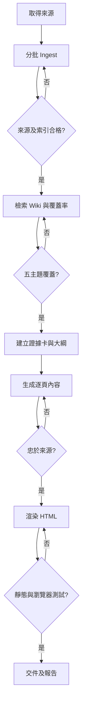

# Graph 與局部 Loop

```mermaid
flowchart TD
 A[取得來源] --> B[分批 Ingest]
 B --> C{來源及索引合格?}
 C -- 否 --> B
 C -- 是 --> D[檢索 Wiki 與覆蓋率]
 D --> E{五主題覆蓋?}
 E -- 否 --> D
 E -- 是 --> F[建立證據卡與大綱]
 F --> G[生成逐頁內容]
 G --> H{忠於來源?}
 H -- 否 --> G
 H -- 是 --> I[渲染 HTML]
 I --> J{靜態與瀏覽器測試?}
 J -- 否 --> I
 J -- 是 --> K[交件及報告]
```

各局部 loop 最多三輪，資料無法核實時停止。來源有問題就回 Ingest；內容錯回內容節點；UI 錯回 HTML。這是設計規則，並非聲稱已經自動化執行整個 AI graph。
